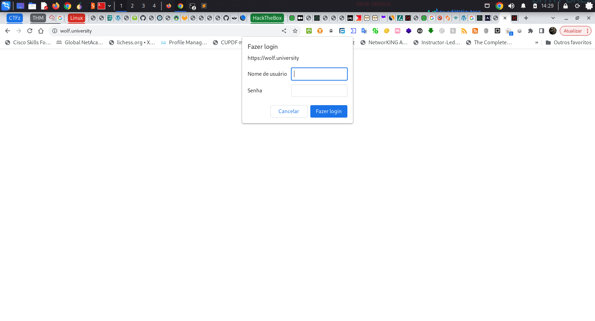
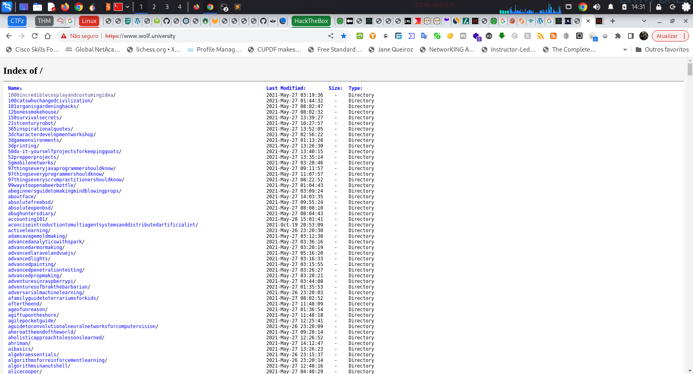

# Wolf University

Site with hundreds of interesting ebooks (https://wolf.university). There are around 2050 e-books. Each e-book is in at least two formats (pdf and epub). The site requests authentication, but I found a way to bypass it. Below, after the screenshots, I show how to bypass the site's security.





## INSTRUCTIONS

The way to bypass security is simple; it basically exploits a configuration error on the server. The error is very GROSS: the admin configured the server to request authentication in the domain https://wolf.university but did not configure it to request from the domain https://www.wolf.university. Just add "www" to the beginning of the website name to access it. When accessing the domain https://www.wolf.university, the browser will inform you that there is an error with the SECURITY CERTIFICATE of the website. Just force the browser to access it.

To automate the download process, I recommend using the Linux `wget` command; on Windows, you can use `wget` in a Linux shell emulator (I recommend [Cmder](https://github.com/cmderdev/cmder/releases/)). I created `.txt` files with the absolute addresses for the `.pdf` and `.epub` files.

### Using wget to download the files

To download a single file, use the command below:
```sh
wget --no-check-certificate FILE_URL
```

Example:
```sh
wget --no-check-certificate https://www.wolf.university/githubfordummies/ebook/githubfordummies.pdf
```

If you want to download several files at once, you can use a source file with the links:
```sh
wget --no-check-certificate -i PATH_OF_FILE_WITH_LINKS
```

Example:
```sh
wget --no-check-certificate -i /Lab/WolfUniversity/links01.txt
```

If you want to download all existing files in a server directory, use the command below:
```sh
wget -r -np -R "index.html" --no-check-certificate DIRECTORY_URL
```

Example:
```sh
wget -r -np -R "index.html" --no-check-certificate https://www.wolf.university/150survivalsecrets/ebook/
```

**Note:** I scanned the files with gobuster, using various FLAG combinations. However, several folders and files did not have their links captured — I got the links for 1407 pdfs and 1407 epubs. 
I will update the files with links and post them.
